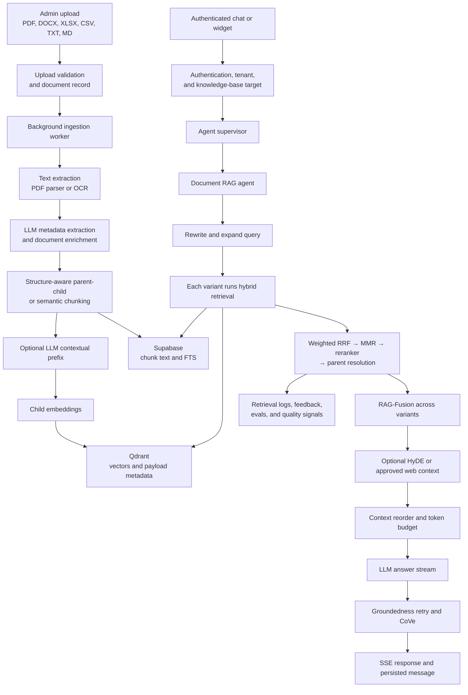

# Web-RAG System Review

**Cerebras-benchmarked architecture and code audit**

**Reviewed:** 2026-07-30

**Scope:** `D:\RAG\Web-RAG`
**Reference:** [How We Built Our Knowledge Base — Cerebras](https://www.cerebras.ai/blog/how-we-built-our-knowledge-base)

## Executive summary

Web-RAG is a capable document-RAG application, not a basic vector-search demo. It already has:

- asynchronous multi-format ingestion;
- structure-aware parent-child chunks;
- optional semantic chunking and contextual prefixes;
- Qdrant vector search plus Supabase full-text search;
- weighted reciprocal rank fusion (RRF), MMR diversification, and Cohere reranking;
- query rewriting, multi-query expansion, HyDE, citations, groundedness checks, and corrective behavior;
- tenant-aware document access, anonymous widget sessions, audit logs, feedback, evaluation, and quality signals;
- production build and deployment configuration.

The strongest conclusion is that the system has good components but needs a simpler and more consistent control plane before it can be called a strong enterprise knowledge base. Retrieval and generation logic are spread across several layers, some scores are compared as though they share a scale, and a few correctness and tenant-isolation defects can override the quality features around them.

### Overall assessment

| Area | Status | Assessment |
| --- | --- | --- |
| File ingestion | Implemented | Strong document pipeline; lacks connector and incremental-sync architecture |
| Chunking and enrichment | Implemented | Parent-child and structural metadata are good foundations |
| Hybrid retrieval | Implemented | Vector + FTS + RRF + reranking work in code |
| Multi-query retrieval | Partially implemented | Each query is fully reranked before cross-query fusion; no final global rerank |
| Evidence contract | Partially implemented | Similar fields exist, but result shapes vary by path |
| Grounded answer generation | Partially implemented | Extensive checks exist, but unverified drafts are streamed before verification |
| Tenant isolation | Partially implemented | Data filters exist; runtime settings and disabled-tenant enforcement need correction |
| Source/project organization | Missing | Queries are tenant-scoped, not project- or data-source-scoped |
| Connectors and freshness | Missing | Ingestion is upload-centric; no continuous source synchronization framework |
| Evaluation and feedback | Implemented | Broad framework exists; important production paths remain lightly tested |
| Deployment readiness | Not verified live | Configuration exists, but the deployed services and data stores were not exercised |

### Highest-priority actions

1. Stop streaming and persisting unverified answer drafts.
2. Make runtime settings resolution tenant-aware and enforce disabled-tenant status.
3. Make the document planner reachable and reduce the pipeline to fuse once, rerank once.
4. Introduce a typed, normalized evidence object used by every retrieval and agent path.
5. Add project/source scoping, explicit freshness signals, source caps, and adjacent-context expansion.
6. Turn lint, high-risk coverage, tenant isolation, and end-to-end RAG checks into release gates.

## Review boundary and method

The review covered the tracked application source, migrations, tests, CI workflows, and deployment configuration. Generated bundles, screenshots, test traces, dependencies, mock binary assets, and secrets were excluded from code-quality conclusions.

The codebase contains **111 Python/TypeScript source files and 28,284 lines** under `backend/app` and `frontend/src`. The separate `D:\RAG\RAG-Landing` prototype was not reviewed as part of the application; it is mentioned only as a duplication and repository-ownership concern.

Evidence labels in this report mean:

- **Implemented:** present in current source code.
- **Partially implemented:** present but incomplete, inconsistent, or not fully reachable.
- **Missing:** no implementation was identified in the reviewed scope.
- **Not verified live:** static code or configuration exists, but behavior depends on external services not exercised in this review.

## Current architecture



### Ingestion

The ingestion pipeline extracts text and metadata, produces hierarchical chunks, embeds child chunks, stores searchable vectors in Qdrant, and stores text rows for FTS in Supabase. The principal implementation is in:

- `backend/app/services/file_search_store.py:134` — extraction;
- `backend/app/services/file_search_store.py:166` — metadata extraction;
- `backend/app/services/file_search_store.py:193-204` — semantic or standard parent-child chunking;
- `backend/app/services/file_search_store.py:216-233` — contextual prefixes and child embedding;
- `backend/app/services/file_search_store.py:293-316` — Supabase and Qdrant writes;
- `backend/app/services/file_search_store.py:324-336` — quality score and processed status.

Qdrant stores tenant, document, chunk-type, and structural metadata indexes (`backend/app/services/qdrant_db.py:38-71`). Search is tenant-scoped when a tenant is available (`backend/app/services/qdrant_db.py:250-259`).

### Retrieval

Hybrid retrieval runs query embedding and FTS concurrently (`backend/app/services/retrieval.py:452-468`), then:

1. selects query-type-dependent vector/FTS weights;
2. merges lists with RRF (`backend/app/services/retrieval.py:525`);
3. applies text-overlap MMR (`backend/app/services/retrieval.py:563-566`);
4. reranks up to eight candidates (`backend/app/services/retrieval.py:18`, `backend/app/services/retrieval.py:576`);
5. filters by score-family-specific pre-generation thresholds;
6. resolves children to parent chunks (`backend/app/services/retrieval.py:638`);
7. logs evidence, timings, score family, and quality diagnostics.

The document agent expands the query, calls that complete retrieval pipeline for every query variant in parallel, and then applies a second RRF across the already-reranked results (`backend/app/services/agents/doc_rag_agent.py:1051-1138`).

### Generation and grounding

The document agent can use HyDE, corrective web retrieval when allowed, lost-in-the-middle reordering, groundedness checks, retry retrieval, and Chain-of-Verification.

The public widget now passes `enable_web_search=False` (`backend/app/routers/widget.py:200`), which is correctly propagated as `allow_web_fallback` by the supervisor. This is an implemented policy in code, but widget refusal behavior still needs a live end-to-end check.

### Authorization and tenancy

Authenticated requests resolve a Supabase user and read `role`, `tenant_id`, and profile `status` (`backend/app/middleware/auth.py:20-44`). Retrieval filters Qdrant and FTS by tenant. Widget tenant lookup accepts only active tenants (`backend/app/services/database.py:32-60`).

The remaining weaknesses are runtime settings lookup, disabled-tenant enforcement for authenticated requests, and the absence of source/project-level authorization inside a tenant.

### Evaluation, observability, frontend, and deployment

The system includes:

- retrieval logs and answer-linked diagnostics (`backend/app/services/database.py:1375`);
- operation audit logs (`backend/app/services/audit.py:87`);
- message feedback and quality inboxes (`backend/app/services/database.py:1547-1816`);
- deterministic and LLM-judge evaluations;
- a golden test set and regression workflow;
- a live RAG-readiness workflow;
- Vercel frontend and Render backend configuration.

Vercel currently rewrites API traffic to a hard-coded Render hostname (`vercel.json:9`). Render declares the required Supabase, Qdrant, OpenRouter, Langfuse, and frontend-origin variables (`render.yaml:15-51`). Static configuration is present; deployed values, logs, migrations, and service health were not read back.

## Cerebras comparison

The Cerebras design should be treated as a set of principles, not a stack to copy literally. Web-RAG serves uploaded business documents rather than Cerebras's Slack, code, incident, and internal-database corpus.

| Cerebras practice | Web-RAG status | Current evidence | Recommended direction |
| --- | --- | --- | --- |
| Meet data where it lives | Missing | Ingestion begins with admin file upload | Add a connector SDK and scheduled/event-driven synchronization |
| One normalized evidence interface | Partially implemented | Retrieval sources share some fields, but document, SQL, HyDE, web, planner, and tool paths emit different shapes | Define one typed `Evidence` contract and adapters per retriever |
| Source-specific distillation | Partially implemented | Document metadata and contextual chunk prefixes exist | Preserve document logic; add source-specific thread/code/table distillers when connectors arrive |
| Multiple retrievers in parallel | Partially implemented | Vector and FTS run in parallel | Add source-specific retrievers and surface their independent ranks/signals |
| Exact lexical, semantic, IDF, and recency signals | Partially implemented | Vector + English FTS are present | Add explicit rare-token and freshness scoring; do not hide signal provenance |
| RRF before one final rerank | Partially implemented | RRF + rerank occurs inside every variant, followed by another RRF | Gather raw lists across variants, fuse once, diversify, then rerank once |
| Source-level deduplication and contribution caps | Partially implemented | Prefix-based content dedup, MMR, and parent collapse exist | Use stable evidence IDs and cap chunks per source/document before final rerank |
| Neighboring-context expansion | Partially implemented | Child hits are replaced by parents | Fetch adjacent sections/pages only after winners are selected |
| Planner → parallel executor → synthesizer | Partially implemented | Planner/executor code exists but is bypassed in document mode | Make planner routing reachable and use normalized evidence bundles |
| Project-scoped search | Missing | Scope is tenant or knowledge-base owner | Add projects as reusable sets of data sources and a default project per user |
| Authentication, authorization, audit | Partially implemented | Tenant filters and audit logs exist | Fix tenant settings and revocation; add per-source ACL filters to every retriever |
| Simple retrieval primitives for agents/MCP | Missing | Internal agent tools exist but no stable external retrieval-primitives interface was identified | Expose narrow, structured, authorization-preserving search tools if agent integrations are required |
| Continuous analytics and evaluation | Implemented | Retrieval logging, feedback, quality signals, CI evals exist | Add live SLOs for freshness, cost, latency, citation support, and isolation |

## Prioritized findings

| ID | Severity | Finding | Impact | Effort | Primary evidence |
| --- | --- | --- | --- | --- | --- |
| F-01 | Critical | Runtime settings lookup is not tenant-filtered | Cross-tenant API-key/configuration use and incorrect billing or model behavior | Medium | `config.py:295-307`, `admin.py:138`, `admin.py:223-228` |
| F-02 | High | Unverified drafts are streamed before groundedness retry | Users and stored messages can contain concatenated answer drafts | Medium | `doc_rag_agent.py:1730-1776` |
| F-03 | High | Disabled tenant status is not enforced in authenticated middleware | Disabling a tenant may not revoke existing authenticated access | Medium | `auth.py:20-44`, `database.py:78-88` |
| F-04 | High | Document planner route is unreachable | Complex document questions do not use the implemented parallel planner | Small | `agent_supervisor.py:55-60`, `agent_supervisor.py:148-152` |
| F-05 | High | Query variants rerank independently before cross-query fusion | Higher cost and a weaker global ranking decision | Large | `retrieval.py:525-638`, `doc_rag_agent.py:1069-1138` |
| F-06 | High | Retrieval quality compares incompatible score families | Valid results may trigger fallback/refusal; fallback RRF results are predictably graded low | Medium | `retrieval.py:596-608`, `doc_rag_agent.py:309-310`, `doc_rag_agent.py:486-505` |
| F-07 | Medium | Semantic cache lookup is effectively exact-bucket lookup | Similar queries rarely share a bucket, so expected latency savings are not realized | Medium | `semantic_cache.py:41-43`, `semantic_cache.py:100-109` |
| F-08 | Medium | Generated contextual prefixes overwrite stored evidence text | Citations and previews can present LLM-generated context as if it were source text | Medium | `contextual_retrieval.py:101-159`, `file_search_store.py:232-246` |
| F-09 | Medium | Lexical retrieval is English-only and lacks explicit freshness/IDF signals | Error tokens, multilingual text, rare identifiers, and newer policies may rank poorly | Large | migration `022`: lines 21-36 |
| F-10 | Medium | No project, connector, incremental-sync, or per-source ACL model | Corpus growth will reduce relevance and complicate enterprise authorization | Large | No corresponding model or service found in reviewed source |
| F-11 | Medium | Diversity and context expansion are incomplete | One document can dominate; adjacent caveats may be omitted | Medium | `retrieval.py:84-142`, `retrieval.py:563-566` |
| F-12 | Medium | HyDE backcheck re-embeds candidate chunks sequentially | Avoidable embedding calls and tail latency | Small | `doc_rag_agent.py:1285-1288` |
| F-13 | Medium | Frontend lint fails and high-risk backend paths have low coverage | Regressions can pass the current release gates | Medium | Local validation results below |
| F-14 | Low | Core modules carry too many responsibilities | Changes are harder to reason about, test, and deploy safely | Large | `doc_rag_agent.py`, `database.py`, `api.ts`, `AdminPage.tsx` |

## Detailed findings and improvements

### F-01 — Tenant-scoped settings are resolved globally

**Confirmed behavior**

The admin API reads and writes settings with `tenant_id` (`backend/app/routers/admin.py:138`, `backend/app/routers/admin.py:223-228`). Runtime resolution calls `_get_cached_setting(key, expiry_time)` without a tenant identifier, and the REST query filters only by key (`backend/app/config.py:145-153`, `backend/app/config.py:295-307`).

Because the service-role key bypasses RLS, multiple rows for the same setting key can be returned. The code uses the first row, so a tenant can run with another tenant's provider key, model, Qdrant endpoint, or Langfuse configuration.

**Recommendation**

- Make tenant identity mandatory for tenant-overridable settings: `SettingsResolver.for_tenant(tenant_id)`.
- Cache by `(tenant_id, key, version)` rather than `(key, ten-second bucket)`.
- Keep infrastructure-wide settings such as Qdrant collection layout and Supabase credentials environment-owned unless deliberate per-tenant resource isolation is implemented.
- Never return or log secret values in diagnostics.

**Verification**

- Create two tenants with different harmless model names and provider stubs.
- Resolve settings concurrently for both tenants and prove no cross-read.
- Add a negative test showing that missing tenant context cannot read tenant overrides.

### F-02 — Groundedness retry streams multiple drafts

**Confirmed behavior**

Inside the retry loop, every generated token is immediately yielded (`backend/app/services/agents/doc_rag_agent.py:1730-1748`). Groundedness runs only after the full answer has been sent (`doc_rag_agent.py:1761-1767`). On failure, the loop increments the attempt and generates another complete answer (`doc_rag_agent.py:1772-1778`).

The chat and widget routers append token events to the persisted response, so retries can produce a first draft followed directly by a second or third draft. A disclaimer after the final retry does not remove earlier unsupported content.

**Recommendation**

- Default safe behavior: generate a candidate off-stream, verify it, then stream only the accepted final answer.
- If first-token latency must be preserved, add an explicit versioned protocol such as `draft_start`, `draft_replace`, and `final`; update the UI and persistence layer atomically.
- Persist only the final accepted version and store rejected drafts only in protected evaluation traces.

**Verification**

- Force groundedness failure on attempt one and success on attempt two.
- Assert the client and database contain exactly one answer.
- Disconnect during verification and verify recovery persists a single terminal response.

### F-03 — Disabled tenants are not an authentication invariant

**Confirmed behavior**

Disabling changes the tenant row to `disabled` (`backend/app/services/database.py:78-88`). New slug/origin resolution filters to active tenants, but authenticated middleware only reads the profile and does not join or query tenant status (`backend/app/middleware/auth.py:20-44`).

**Recommendation**

- Reject authenticated requests when the profile has no tenant or the tenant is not active.
- Recheck tenant status on widget chat/feedback requests, not only session creation.
- Add a database-level helper/RLS condition so application mistakes cannot restore access.
- Invalidate or version widget tokens when a tenant is disabled.

**Verification**

- Disable a tenant while authenticated and confirm chat, documents, admin, eval, and tools return a consistent authorization error.
- Confirm existing widget tokens stop working.
- Confirm other tenants remain unaffected.

### F-04 — Planner exists but document mode bypasses it

`route_query()` can return `plan_execute` for multipart document questions (`backend/app/services/agent_supervisor.py:55-60`). In `execute()`, however, `use_documents=True` assigns `route = "doc_rag"` directly (`agent_supervisor.py:148-152`), so the later planner branch at lines 179-181 cannot be reached through normal document mode.

**Recommendation**

Call deterministic document routing even when documents are enabled, or replace the keyword list with a typed planner decision that can choose direct retrieval versus decomposition. Test routing and execution together.

### F-05 — Fuse once, rerank once

Current flow:

1. each query variant performs vector + FTS;
2. each variant performs RRF, MMR, and Cohere reranking;
3. the agent applies RRF again across the reranked outputs;
4. no final reranker compares all global winners against the original question.

This uses multiple reranker calls and fuses already-transformed score lists. It also limits each variant to `MAX_RERANK_CANDIDATES = 8`, even when query complexity requests more.

**Recommendation**

Return raw ranked candidates and signal metadata from retrieval primitives. Fuse all variant/retriever lists with weighted RRF, deduplicate and cap by source, then call the reranker once with the original user question. Expand parent/neighbor context only after the final winners are known.

### F-06 — Score-family semantics are inconsistent

Retrieval correctly labels Cohere, RRF fallback, vector, and FTS score families (`backend/app/services/retrieval.py:596-608`). The document agent then grades all sources using vector-style constants `0.5` and `0.4` (`backend/app/services/agents/doc_rag_agent.py:309-310`, `486-505`).

An RRF fallback result accepted at `0.015` cannot pass a later `0.4` quality test. Cohere scores are also not vector similarities.

**Recommendation**

- Define quality policy per score family.
- Prefer calibrated rank features or an explicit `quality_band` produced by the retrieval stage.
- Log raw signals, but do not compare raw scores across algorithms.
- Calibrate thresholds against the golden set and production feedback rather than fixed intuition.

### F-07 — Semantic cache is not meaningfully semantic

The cache hashes the first 16 embedding dimensions rounded to six decimals, then compares cosine similarity only with entries inside that exact hash bucket (`backend/app/services/semantic_cache.py:41-43`, `100-109`). Near-neighbor queries are extremely unlikely to produce the same hash.

**Recommendation**

Use exact-query caching separately, and use either a small ANN index, a bounded linear scan of tenant-scoped entries, or locality-sensitive hashing for semantic lookup. Include corpus/version, project, ACL, retrieval configuration, and model version in the namespace.

### F-08 — Separate raw evidence from embedding enrichment

Contextual prefixes mutate `child["text"]` (`backend/app/services/contextual_retrieval.py:159`). The mutated text is both embedded and saved as the chunk's `content` (`backend/app/services/file_search_store.py:232-246`).

**Recommendation**

Store:

- `raw_content` — exact extracted source text used for previews and citations;
- `retrieval_content` — contextualized text used for embeddings and optional lexical retrieval;
- `context_prefix` — generated enrichment with model/version provenance.

Answers should quote and cite `raw_content`, while ranking may use `retrieval_content`.

### F-09 — Improve lexical and freshness retrieval

The current FTS RPC uses `plainto_tsquery('english', search_query)` in migration 022 (`backend/supabase/migrations/022_accuracy_provider_sources.sql:21-36`). No explicit rare-token/IDF list or recency score is surfaced to fusion.

**Recommendation**

- Add an exact-token path for identifiers, error strings, SKUs, and quoted phrases.
- Select or normalize text-search configuration by source language.
- Carry `source_updated_at`, `ingested_at`, and optional validity intervals into evidence.
- Apply source-specific age decay only where information expires; do not decay stable manuals by default.
- Treat lexical, rare-token, and freshness contributions as separate explainable rank signals.

### F-10 — Add connectors, projects, and source authorization together

Projects should be lightweight named collections of reusable data sources. Do not duplicate evidence when a source belongs to multiple projects.

Connector implementations should declare:

- source type and stable source ID;
- cursor/watermark and synchronization mode;
- normalization/distillation strategy;
- update and deletion/tombstone semantics;
- freshness expectation;
- ACL mapping;
- observability and retry policy.

Authorization must be applied inside every retriever before ranking. Post-filtering unauthorized results reduces recall and risks leaks through caches and logs.

### F-11 — Source diversity and adjacent context

Current content-prefix deduplication and Jaccard MMR reduce repetition, and parent resolution broadens child hits. They do not enforce a stable per-document contribution cap or fetch the sections immediately before and after a winning section.

**Recommendation**

- Deduplicate by stable evidence/source IDs rather than content prefixes.
- Cap candidates per document/source before the final reranker.
- After final ranking, fetch adjacent sections using document order, heading path, page range, or parent/child relationships.
- Reapply the token budget after expansion.
- Perform lost-in-the-middle placement after truncation; current generation truncates from the front (`backend/app/services/gemini.py:143-160`), which can discard the high-ranked item intentionally placed at the end by `doc_rag_agent.py:1708`.

### F-12 — Reduce HyDE and verification latency

HyDE backcheck embeds each returned chunk sequentially (`backend/app/services/agents/doc_rag_agent.py:1285-1288`), even though those chunks already have stored vectors. Multi-query expansion, per-variant reranking, grounding retries, and CoVe can compound latency and cost.

**Recommendation**

- Return stored vectors or original-query similarity from Qdrant and avoid re-embedding retrieved text.
- Batch any unavoidable embeddings.
- Use query classification to enable expensive stages only when their measured quality gain justifies them.
- Record per-stage token use, provider cost, and p50/p95/p99 latency.

### F-13 — Quality gates do not match production risk

Observed locally on 2026-07-30:

| Check | Result |
| --- | --- |
| `python -m pytest tests -q` | **345 passed**, 19 dependency/runtime warnings |
| `pytest --cov=app` | **54% total coverage** |
| `npm run build` | **Passed** |
| `npm run lint` | **Failed:** 18 errors, 1 warning |

Notable backend coverage:

| Component | Coverage |
| --- | ---: |
| Retrieval service | 80% |
| Document RAG agent | 47% |
| Authentication middleware | 20% |
| Agent supervisor | 30% |
| Plan executor | 13% |
| Agent retrieval tools | 0% |
| Ingestion orchestration | 15% |
| Qdrant service | 12% |
| Groundedness | 24% |
| Text extraction | 16% |

The local tests ran on Python 3.14 while the project targets Python 3.12. Compatibility warnings from Langfuse/Pydantic and PyIceberg should therefore not be treated as production failures, but local and CI runtimes should be aligned.

Frontend lint findings include:

- unused `_messages` in `frontend/src/components/ChatHistoryPanel.tsx:22`;
- missing `flushTokens` callback dependency in `frontend/src/hooks/useAnonymousChat.ts:60-158`;
- synchronous effect state update in `frontend/src/hooks/useChunkedUpload.ts:91-103`;
- React compiler dependency/effect findings in `useDocuments.ts`, `useThreads.ts`, `AdminPage.tsx`, and `OwnerLockPage.tsx`.

**Recommendation**

- Make frontend lint mandatory in CI.
- Raise coverage gates by risk area rather than relying only on a 50% global threshold.
- Add contract tests that execute router → supervisor → retrieval → generation paths.
- Keep live readiness and eval jobs required for staging promotion.

### F-14 — Decompose high-change modules

Current module sizes:

| Module | Lines | Suggested boundary |
| --- | ---: | --- |
| `frontend/src/pages/AdminPage.tsx` | 2,830 | settings, users, conversations, evals, quality, audit feature modules |
| `backend/app/services/agents/doc_rag_agent.py` | 2,067 | query planning, retrieval orchestration, fallback policy, generation, verification |
| `backend/app/services/database.py` | 1,822 | tenant, chat, documents, settings, feedback, eval, audit repositories |
| `frontend/src/lib/api.ts` | 1,370 | typed clients by backend resource |

Decomposition should follow existing behavior and tests; it should not be combined with ranking changes in one pull request.

## Proposed future interfaces

These are recommendations only. No API, type, or database change was made during this review.

### Normalized evidence

```python
class Evidence(BaseModel):
    evidence_id: str
    tenant_id: str
    project_id: str | None
    source_type: str
    source_id: str
    document_id: str | None
    raw_content: str
    retrieval_content: str
    title: str | None
    citation: CitationMetadata
    source_updated_at: datetime | None
    ingested_at: datetime
    acl_tags: list[str]
    signals: RetrievalSignals
    metadata: dict[str, object]
```

`RetrievalSignals` should keep vector similarity, lexical rank, rare-token score, recency score, RRF score, and reranker score in separate fields. It should also record the algorithm/model version.

### Scoped retrieval request

```python
class RetrievalRequest(BaseModel):
    query: str
    project_id: str | None = None
    source_types: list[str] = []
    top_k: int = 10
    include_neighbors: bool = True
```

`tenant_id`, user identity, and authorization scope must be server-derived, never trusted from a client request. The retrieval result should return `list[Evidence]` plus bounded diagnostics.

### Connector contract

```python
class SourceConnector(Protocol):
    async def discover(self, scope: ConnectorScope) -> AsyncIterator[SourceRecord]: ...
    async def checkpoint(self) -> ConnectorCheckpoint: ...
    async def permissions(self, record: SourceRecord) -> SourceACL: ...
```

Connectors should output normalized source records; source-specific distillers then produce evidence rows. Synchronization must be idempotent and preserve tombstones so removed source material stops appearing in search and caches.

## Phased implementation roadmap

### Phase 0 — Correctness, isolation, and release gates

- Fix F-01 through F-04.
- Stream and persist exactly one verified answer.
- Resolve settings with explicit tenant context.
- Enforce active tenant status in middleware, widgets, and database policies.
- Make planner routing reachable.
- Clear frontend lint and add it to CI.

**Acceptance gate:** cross-tenant settings tests, disabled-tenant revocation tests, single-answer retry tests, planner integration tests, backend tests, frontend lint/build, and current RAG regression suite all pass.

### Phase 1 — Evidence contract and fuse-then-rerank

- Introduce normalized internal `Evidence` and score-family types.
- Adapt vector, FTS, HyDE, SQL, web, and agent-tool results.
- Gather raw candidates across variants and retrievers.
- Apply stable deduplication, per-source caps, one RRF, one diversification pass, and one final rerank.
- Replace family-agnostic quality thresholds with calibrated policies.
- Correct semantic-cache lookup and namespace versioning.

**Acceptance gate:** improved or equal recall@k, context precision, citation support, latency, and provider cost on the golden set; no regression in tenant isolation.

### Phase 2 — Retrieval strength and context assembly

- Add exact-token, multilingual lexical, rare-token, and source-specific recency signals.
- Separate raw evidence from retrieval enrichment.
- Add adjacent section/page expansion after final ranking.
- Apply token budgeting before final lost-in-the-middle placement.
- Batch or remove redundant HyDE embeddings.

**Acceptance gate:** dedicated error-code, multilingual, stale-policy, rare-term, table, and adjacent-caveat tests pass with cited source evidence.

### Phase 3 — Connectors, projects, freshness, and ACLs

- Add project and data-source models.
- Build the connector contract, synchronization checkpoints, tombstones, and source distillers.
- Start with one high-value connector, not many simultaneous integrations.
- Enforce source ACLs in vector, lexical, cache, log, and citation paths.
- Add user default-project selection and project-scoped admin controls.

**Acceptance gate:** incremental update/delete propagation, freshness SLO, project relevance, permission changes, cache isolation, and source-removal tests pass.

### Phase 4 — Evaluation and operational maturity

- Expand golden cases by query class, source type, tenant, language, and failure mode.
- Measure retrieval recall/precision, nDCG or MRR, answer relevance, claim support, citation precision/recall, refusal correctness, freshness, latency, and cost.
- Add canary tenants and staging upload-to-answer checks.
- Define production dashboards and alerts for zero results, weak results, fallback, unsupported claims, indexing lag, and provider failures.

**Acceptance gate:** versioned baseline, bounded regression thresholds, staging readiness, and rollback criteria are enforced before production deployment.

## Verification completed and remaining

### Completed in this review

- Backend unit suite: 345 passed.
- Backend coverage: 54% total.
- Frontend production build: passed.
- Frontend lint: failed with 18 errors and one warning.
- Application source remained unchanged.
- No file, folder, document, tenant, database row, or external resource was deleted.

### Not verified live

- Supabase migrations actually applied in production.
- Tenant rows, settings, profiles, and RLS behavior in the live database.
- Qdrant collection dimension, payload indexes, chunk counts, and search results.
- Admin upload → processed status → document-specific answer → citations.
- Deployed widget origin/session/stream/refusal/feedback behavior.
- Render/Vercel environment variables, logs, cold-start behavior, and current deployed revision.
- Langfuse traces, Cohere availability/fallback behavior, and production cost.

`PROGRESS.md:80-81` still marks retrieval verification and upload-to-answer testing as open. Those checks remain launch blockers until direct runtime evidence supersedes the ledger.

## Final recommendation

Do not start by adding more agents or more retrieval techniques. First make the current evidence, scores, tenant context, and answer lifecycle consistent. After that foundation is reliable, the highest-value Cerebras-inspired expansion is:

1. a normalized evidence contract;
2. fuse-once/rerank-once retrieval;
3. projects and source-scoped authorization;
4. incremental connectors with freshness;
5. evaluation that measures retrieval, citations, latency, cost, and isolation together.

That order preserves the strongest parts of the current system while removing the defects most likely to cause incorrect, expensive, or cross-tenant behavior.
